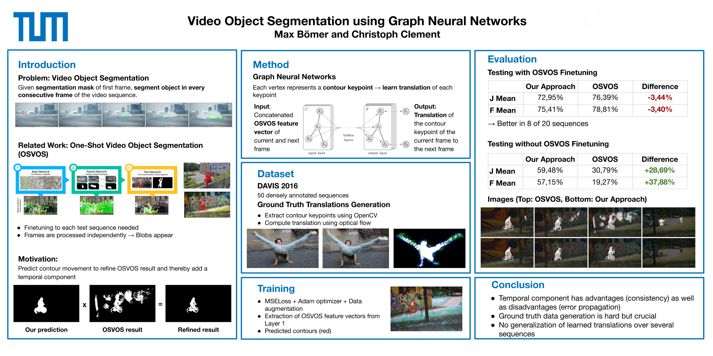

# Video Object Segmentation using Graph Neural Networks

## Requirements
Easiest way to setup: [Google Deep Learning VM with PyTorch GPU Image](https://cloud.google.com/deep-learning-vm/?hl=de&_ga=2.216165718.-1725930117.1547198185)
- PyTorch GPU 1.1.0
- PyTorch Geometric: [Installation](https://pytorch-geometric.readthedocs.io/en/latest/notes/installation.html)
- TensorboardX

## Repository Structure
### Files
- **download_DAVIS_2016.sh**: Downloads DAVIS 2016 dataset and saves it to **DAVIS_2016** folder
- **01_data_augmentation.py**: Augment DAVIS images
- **02_contours_and_translations.py**: Create contours and translations for DAVIS images
- **03_pg_dataset.py**: Create PyTorch Geometric train and val dataset
- **04_training.py**:  Train a model
- **05_testing.py**: Test a trained model on DAVIS val sequences
- **04_training_with_plots.ipynb**: Same as 04_training, but with plots of ground truth data, train and val loss, and outputs
- **osvos_parent_model_results.ipynb**: Create segmentation masks from OSVOS parent model
- **README.md**: This file

### Folders
- **DAVIS_2016**: Folder in which DAVIS 2016 dataset is stored (gets created if you run the scripts)
- **OSVOS-PyTorch**: Original OSVOS-PyTorch implementation
- **pg_datasets**: Folder to store PyTorch Geometric (PG) DAVIS 2016 dataset (gets created if you run the scripts)
- **pg_models**: Folder to store trained models (gets created if you run the scripts)
- **pg_networks**: Folder to store different types of PG networks
- **src**: Folder to store scripts for configuration,  data creation, the PG dataset class, plotting, and training

## Running it

1. Download DAVIS 2016 dataset by running `download_DAVIS_2016.sh`.
2. Set parameters in `src/config.py`. Default options do not create augmented data. 
3. Run the scripts in their order (`01_....py`, `02_....py`, ...)
4. If you want to see plots of ground truth data, train and val loss, and output predictions, use `04_training_with_plots.ipynb` for training.

Do not hesitate to contact us if you have questions.

